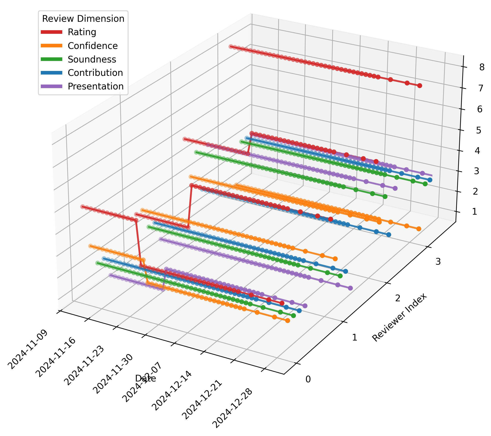

# Paper Copilot OpenReview Archive

This repository is the OpenReview-derived dataset archive for
[Paper Copilot](https://papercopilot.com/). It contains standard
venue-year records, author/profile enrichment, PDF metadata, and a
timestamped ICLR subset with code and derived temporal reviewer records.

Canonical repository:
[github.com/papercopilot/openreview](https://github.com/papercopilot/openreview)

## Dataset

The general archive is organized as JSON/JSONL data products:

| Path | Contents |
| --- | --- |
| `venues/<venue>/<venue><year>.jsonl` | Normalized per-paper OpenReview records for a venue-year. |
| `authors/<venue>/<venue><year>.jsonl` | Author profile and affiliation enrichment keyed by OpenReview forum ID. |
| `pdf/<venue>/<venue><year>.jsonl` | PDF metadata keyed by OpenReview forum ID. |

Current inventory: 45 venue-year JSONL files, 40 author-enrichment JSONL
files, and 9 PDF metadata JSONL files. Covered venues include ICLR,
NeurIPS/NIPS, ICML, CoRL, COLM, EMNLP, AISTATS, 3DV, WWW, ALT, AI4X,
and ACMMM.

Each `.jsonl` file stores one JSON object per line. Fields vary by venue
and year because OpenReview forms evolve, but venue records commonly
include:

- Paper metadata: `id`, `title`, `track`, `status`, `abstract`,
  `primary_area`, `site`, `bibtex`.
- Authorship/profile metadata: `author`, `authorids`, `or_profile`,
  `aff`, `aff_domain`, `position`, `homepage`, `dblp`, `google_scholar`,
  `orcid`, `linkedin`.
- Review signals: semicolon-separated per-reviewer fields such as
  `rating`, `confidence`, `soundness`, `contribution`, `presentation`,
  `correctness`, or `technical_novelty`.
- Aggregates and activity: fields ending in `_avg`, plus word/reply
  counts such as `wc_review`, `reply_reviewers`, and `reply_authors`.

The processed paper-list release that combines this OpenReview archive
with official conference pages and other sources lives at
[github.com/papercopilot/paperlists](https://github.com/papercopilot/paperlists).
Use this data for aggregate, reproducible research; do not attempt to
de-anonymize reviewers or use parsed profile metadata for high-stakes
individual decisions.

## Timestamped ICLR Subset

The archive also includes timestamped ICLR snapshots for studying how
review scores evolve over time. This subset is the data release behind
the ICLR Daily Score Archive used in
[Paper Copilot: Tracking the Evolution of Peer Review in AI Conferences](https://arxiv.org/abs/2510.13201).
The paper is affiliated with the University of Southern California,
University of Cambridge, Stanford University, and Paper Copilot.

Raw snapshots are stored under:

| Path | Contents |
| --- | --- |
| `venues/iclr/iclr2024/*.jsonl` | ICLR 2024 daily or near-daily review snapshots. |
| `venues/iclr/iclr2025/*.jsonl` | ICLR 2025 daily or near-daily review snapshots. |
| `venues/iclr/iclr2026/*.jsonl` | ICLR 2026 continuing archive snapshots. |

Snapshot filenames encode collection time:

```text
iclrYYYY.MMDDYYYY.jsonl
iclrYYYY.MMDDYYYY.HH.jsonl
```

Each snapshot line uses the same JSONL record format as the general
dataset. Compare records by `id` across snapshots to reconstruct a
paper's review timeline.

Processing code for this subset lives under `code/iclr2026/`:

| Path | Purpose |
| --- | --- |
| `code/iclr2026/temporal.py` | Traces reviewer identities across timestamped snapshots and builds reviewer-level temporal JSON. |
| `code/iclr2026/temporal_visual.py` | Visualizes traced reviewer-score footprints. |

Example visualization generated from traced ICLR reviewer footprints:



The temporal pipeline builds reviewer-level JSON files named:

```text
iclrYYYY_threshold<k>_<n>_reviewers.json
```

Each derived record has:

```json
{
  "id": "00SnKBGTsz",
  "title": "DataEnvGym: Data Generation Agents in Teacher Environments with Student Feedback",
  "tracing_score": 2,
  "review": {
    "rVo8": {
      "rating": "5;6",
      "confidence": "4;4",
      "soundness": "2;2",
      "contribution": "3;3",
      "presentation": "3;3"
    }
  }
}
```

`tracing_score = -1` means the reviewer profile was stable without
Hungarian tracing; non-negative values indicate the minimum successful
tracing threshold. Some generated files may contain `Infinity` for
untraced records, which should be normalized if strict JSON is required.
By default, score strings such as `"5;6"` store first/last values; with
`--first_last_only` disabled they store the full semicolon-separated
trajectory. ICLR 2024 uses `rating`, `confidence`, `correctness`, and
`technical_novelty`; ICLR 2025/2026 use `rating`, `confidence`,
`soundness`, `contribution`, and `presentation`.

Paper links:

- ICLR 2026 poster:
  [iclr.cc/virtual/2026/poster/10010812](https://iclr.cc/virtual/2026/poster/10010812)
- OpenReview:
  [openreview.net/forum?id=CyKVrhNABo](https://openreview.net/forum?id=CyKVrhNABo)
- arXiv:
  [arxiv.org/abs/2510.13201](https://arxiv.org/abs/2510.13201)

If you use the timestamped ICLR subset, please cite:

```bibtex
@inproceedings{yang2026papercopilot,
  title = {Paper Copilot: Tracking the Evolution of Peer Review in AI Conferences},
  author = {Yang, Jing and Wei, Qiyao and Pei, Jiaxin},
  booktitle = {The Fourteenth International Conference on Learning Representations},
  year = {2026},
  url = {https://openreview.net/forum?id=CyKVrhNABo}
}
```
